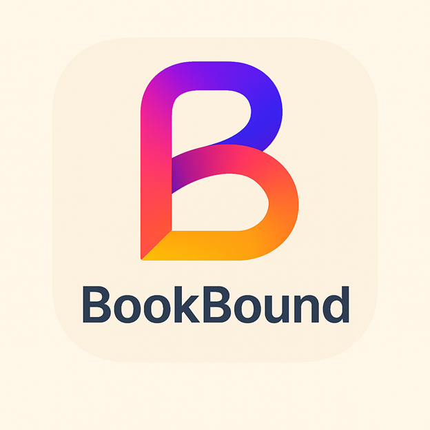

# Bookbound-app
For Final/Group Project in Enterprise Application Development class.

Our app, BookBound, allows current book readers to keep track of what physical books they’ve been reading; the title, author, genre, how many pages, and-if applicable-how many books are in the series. 
In addition, new book readers would be able to search for what books they want to start reading based on the same filters or search terms they identify. 
Books would not be provided within the app, only where to get them (physically only).

We envision our app to look something like this:

We start with the loading page: 

Then we have the Sign Up page for new users to set up their account (the Sign In page would look identical to this page minus the name or email)

Once signed in, we will send users to their user dashboard:

We will have a search page with historical previously searched items:

If the reader wants more details on a specific book
we will give them a short description with the option to buy it off amazon or a site (Add to the library) 
and once added the ability to read the book in the app: 

Most users love insights on their reading patterns and how frequently they are reading 
and that is what the final page gives our readers the opportunity to do: 

Our planned functional requirements are as followed:

As a long-time reader, 
I want to record what physical books from the same series I’ve read so far
So that I can get an idea of what books I need to get next.
- Given that I’m currently signed into the application and it has books from the series The Witcher with 8 books in the series and only the first 4 books recorded into the series as finished.
- When I’m about to add the next book, I need to select “Add book”, add how many pages were in the book, and that it is currently finished. 
- Then the app will display the 5th book title, where a physical copy can be bought, show the series is 5 out of 8 books, and finally display any potential books or series to investigate reading if I cannot get the next book for The Witcher series. 
As a new but interested reader,
I want to search up what books fall under my specific genres
So that I can select what books or series to buy and start to read.
- Given that the app knows I’m a new reader and has a selection of books from all types of genres, authors, and series-including science fiction. The app will suggest top picks that fall under the genre being searched for (in the case of science fiction, these could be books like: Flatland, Starter Villain, Project Hail Mary).
- When I want to search for the genre Science Fiction, I select “Browse by Genres”, enter Science Fiction for what genre to look for, press “Search”. 
- Then the app will show me a variety of books that fall under the science fiction category including Leviathan Wakes, Dune, and I, Robot.
As an avid book collector,
I want to organize all my books and be able to filter quickly
So that they can determine what books are marked as “to read next”.
- Given I’ve got a plethora of books, and I need to specifically mark 1 book as “to read next.”
- When I open the app, I select “My Collection”, filter by books not marked with anything, and check the books from the filtered selection.
- Then I will find the books I haven’t marked yet and select one of them, some of them, or all of them, as “to read next.”

Our UML Diagram for the application looks like this:

The JSON Schema for each of the classes:
Book JSON Schema: 
{
  "id": "string",              // unique identifier (UUID or DB-generated)
  "title": "string",
  "author": "string",
  "genre": "string",
  "totalPages": "integer",
  "seriesName": "string | null",   // optional: name of the series
  "seriesOrder": "integer | null", // optional: which book in the series
  "purchaseLocations": [
    {
      "storeName": "string",
      "storeAddress": "string",
      "storeUrl": "string | null"
    }
  ]
}

User’s Book Tracking JSON Schema
			{
  "id": "string",              // unique identifier for this record
  "userId": "string",          // link to user
  "bookId": "string",          // link to Book entity
  "currentPage": "integer",    // where the user is
  "status": "string",          // e.g., "reading", "completed",  "plan_to_read"
  "startedAt": "string (date)",
  "finishedAt": "string (date) | null"
}

Search Parameters (Query Example)
{
  "title": "string | null",
  "author": "string | null",
  "genre": "string | null",
  "minPages": "integer | null",
  "maxPages": "integer | null",
  "seriesName": "string | null"
}

The members of our group and their roles are:
UI Specialist - Denis Kalala
Business Logic and Persistence Specialist - Yishak Teklemariam
Product Owner/Scrum Master/DevOps/GitHub Administrator - Devon Mabrey
Quality Assurance - Shawn Theaver

The link to our github project is here: github.com/users/mabrey64/projects/1
And the link to our first milestone is here: https://github.com/users/mabrey64/projects/1/views/1?pane=issue&itemId=115377811&issue=mabrey64%7CBookbound-app%7C1
(Apologies if this isn't the exact qualifications for the project. I'm still learning how that works as I go.)

Finally, this is an image of the planned schedule created every Sunday at 8 pm that is a recurring meeting until the Sunday before the final project is due:

https://teams.microsoft.com/l/meetup-join/19%3ameeting_MmU2YjE4ODYtMDRmMS00ZGQzLTg1YTItYmQxMDIzMGYxZjcw%40thread.v2/0?context=%7b%22Tid%22%3a%22f5222e6c-5fc6-48eb-8f03-73db18203b63%22%2c%22Oid%22%3a%2292e96ff6-a6b5-42f7-acff-adb29b77ccc2%22%7d

